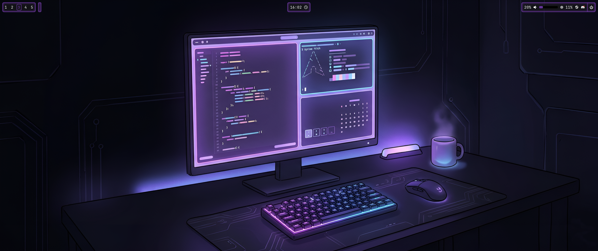
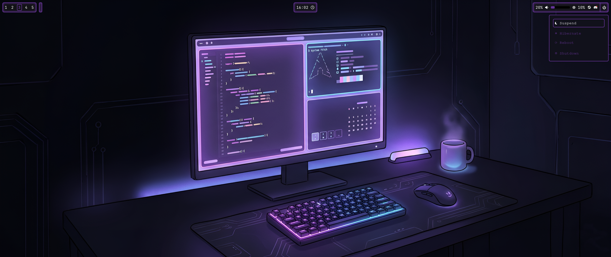
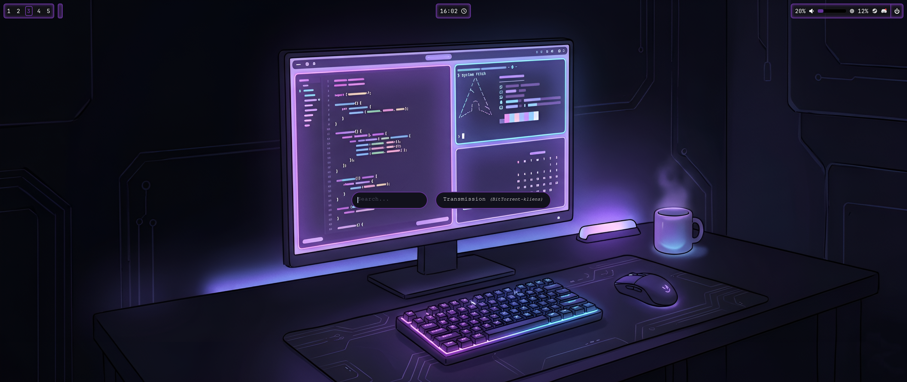
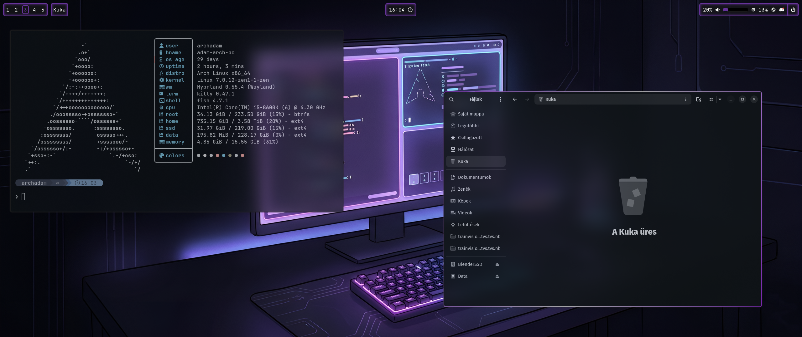

# 💜 Hypr-Lab

Hypr-Lab is an evolving desktop environment built on top of the **Hyprland** tiling window manager. 

---

## 🚀 About the Project

First and foremost: **Hypr-Lab does not want to be just another dotfiles repository.** 

I started writing and configuring Hypr-Lab about a month ago, deeply diving into wikis, YouTube tutorials, and leveraging AI assistance. If I had to put a version number on its current state, I would call it **v0.7**. 

In my everyday (civilian) life, I am not a developer or a programmer. In fact, I have only been using Linux for a little over 6 months. By hobby, I am a 3D artist working with **Blender**, which means focusing on my workflow is absolutely critical for me. 

## Preview

### 🙏 Acknowledgments
Hypr-Lab was heavily inspired by **ML4W**. On behalf of all its users, I would like to say a massive thank you to **Stephan Raabe** for his incredible work. While ML4W was excellent for my initial needs, over time I realized it packed too many features that I simply didn’t use. This sparked the idea to create my own desktop environment—one tailored for productivity, free from distracting bloat, easy on the eyes, and optimized to look stunning on **UltraWide (2560x1080)** displays.

---

## ✨ Features & Design Philosophy

Hypr-Lab was born out of a passion for a focused, hobby-driven desktop experience built around two core pillars: **Productivity** and **Minimalist Aesthetics**.

* **Aesthetic Palette:** Deep purple tones harmonizing with blurred, semi-transparent windows. It works best with dark wallpapers (I have included a few AI-generated and upscaled wallpapers to get you started).
* **Keyboard-Centric:** Designed primarily for keyboard workflow, though essential functions remain accessible via mouse control.
* **Visual Polish:** To balance productivity with premium looks, the active window features an aesthetic, animated gradient border effect.
* **Window Management:** Clean layouts designed to keep you focused on your active tasks.
* **Workspaces:** This version features **5 fixed workspaces**, which will expand to a maximum of 10 in future updates.

---

## ⚠️ Disclaimer

> **USE AT YOUR OWN RISK!**
> This is an early, experimental desktop environment. I take absolute zero responsibility for any system instability, breaks, or data loss. Please treat it as the work-in-progress project that it is.

That being said, constructive criticism, feedback, and ideas are always welcome!

---

## 🛠️ Important Installation Notes

❗ **CRITICAL STEP BEFORE INSTALLATION** ❗

1. **Dependencies:** You **must** install everything listed in the `Docs/Depends.txt` file before running the environment. Missing dependencies *will* cause issues or system breakage.
2. **Keybindings:** After installation, you can find a complete list of all currently active and usable shortcuts in the `Docs/keybindings.txt` file.

---

Thank you for checking out my project!

Best regards,  
**Adam**