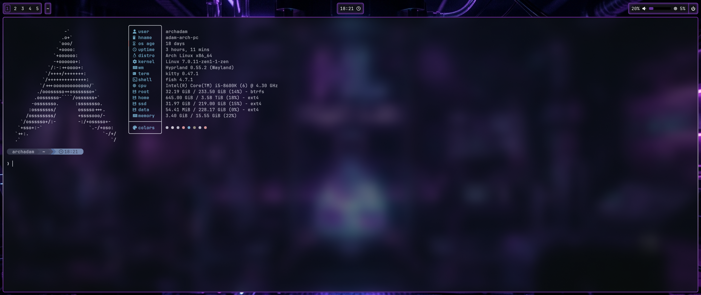
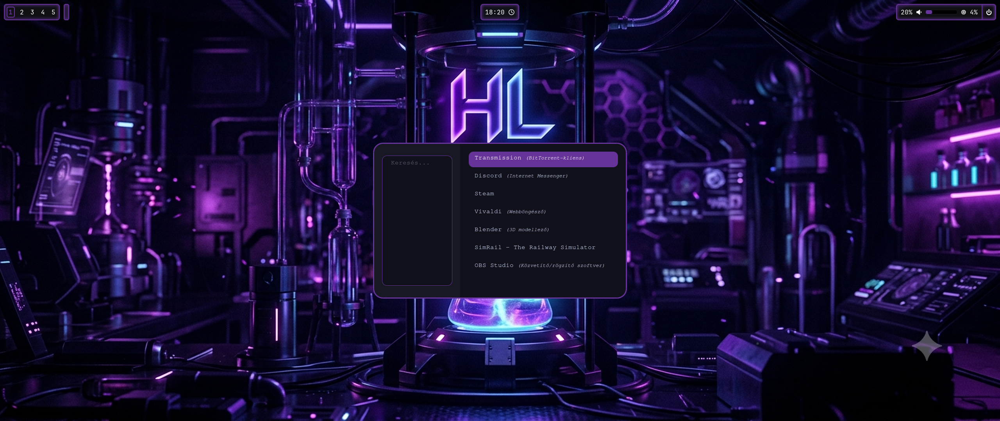
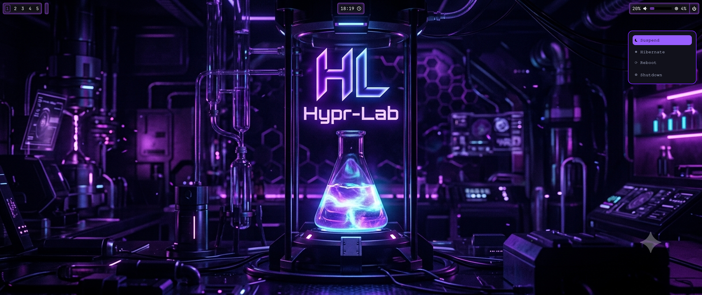

Readme

# VisualSilence / Hypr-Lab

Hello! I’m Ádám, a Linux enthusiast and hobby power user from Hungary.

I currently use Arch Linux as my daily operating system and spend much of my free time exploring Linux customization, desktop design, workflow optimization, and self-hosted solutions.

Hypr-Lab is my personal Hyprland project and learning environment — a place where experimentation, creativity, and continuous improvement meet.

## Preview

### Desktop

### Application Launcher

### Power Menu

VisualSilence is the design philosophy behind this project.

I believe a desktop environment should be both functional and visually coherent. It should support productivity, stay out of the way when work needs to get done, and still provide an enjoyable experience every time the screen turns on.

# The goal is not minimalism for its own sake, nor aesthetics without purpose, but a balance between:

* Functionality
* Simplicity
* Consistency
* Visual identity

Every component included in this project is evaluated through those principles.

# What is Hypr-Lab?

Hypr-Lab is the practical implementation of the VisualSilence philosophy.

The name reflects the project’s purpose: a laboratory for learning, testing, and refining ideas within the Hyprland ecosystem.

Rather than building on top of a heavily customized distribution or copying an existing setup, I chose to create my own environment piece by piece. Every configuration, adjustment, and design decision is part of an ongoing learning process.

Hypr-Lab is built around a futuristic purple laboratory aesthetic featuring:

* Custom Waybar styling
* Rofi application launcher
* Rofi power menu
* Animated window borders
* Consistent visual language across all components
* Workflow-oriented desktop design

The project continues to evolve as I learn new tools, discover better solutions, and refine my workflow.

# Project Goals

The long-term objective of Hypr-Lab is to create a desktop environment that is:

* Visually distinctive
* Comfortable for daily use
* Easy to maintain
* Modular and organized
* Built on understanding rather than copy-pasting

This repository documents that journey.

# Repository Status

Hypr-Lab is actively developed and continuously evolving.

Configurations, themes, scripts, and design choices may change over time as new ideas are tested and existing components are improved.

# Contributions & Feedback

Suggestions, feedback, and constructive criticism are always appreciated.

Whether you have an idea, spot an issue, or simply want to discuss desktop customization, feel free to open an issue or start a conversation.

# Thank You

Thank you for taking the time to visit the project.

Welcome to the lab.

— Ádám